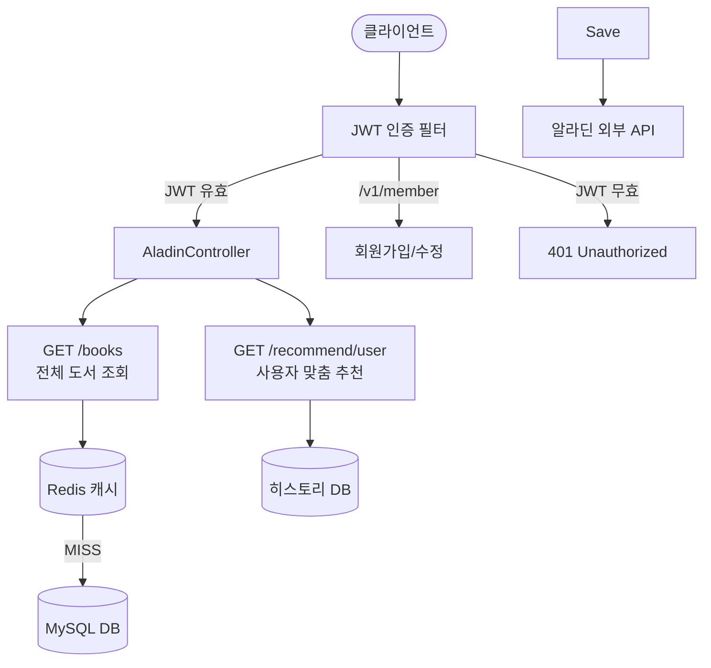

## 도서 추천 백엔드 서비스

알라딘(API)를 활용해 도서 추천을 제공하는 서비스입니다.  
회원 관리, JWT 기반 인증/인가, 도서 추천 로직, 이력 관리 등을 직접 구현해 **실무형 백엔드 역량**을 보여주기 위한 포트폴리오 프로젝트입니다.

### 프로젝트 개요

- **목표**: 사용자에게 책을 추천하고 추천한 책은 다시 노출되지 않는 책추천 서비스
- **역할**: 개인 프로젝트 (요구사항 정의 → 아키텍처 설계 → 개발 → 테스트/운영까지 전 과정 모두 혼자 100%진행) 

### 기술 스택

- **Language**: Java 21
- **Framework**: Spring Boot 3.5.x
- **Build Tool**: Gradle 
- **Database**: MySQL 
- **Cache / 기타 인프라**: Redis
- **Security**: Spring Security, JWT
- **Persistence**: Spring Data JPA, Hibernate
- **Scheduler**: Spring Scheduling (`@EnableScheduling`)
- **기타**: Resilience4j Rate Limiter (알라딘 API 보호), ShedLock (스케줄 락, `ShedLockConfig`)

### 핵심요약
- **도메인 모델 패턴 적용**: 도메인 모젤 패턴을 적용하여 로직이 분산되지 않고 엔티티 안에서 로직을 관리하였고, 책임 분리 및 응집도를 증가하였습니다.
- **외부 API 의존성 관리**: 호출량 제한(Resilience4j 설정 기반)과 예외/폴백 흐름 설계
- **성능 최적화**: 전체 목록 Redis 캐시(TTL 24h)로 조회 부하 완화
- **운영 안정성**: ShedLock으로 배치 중복 실행 방지(분산 환경 고려)
- **보안**: Spring Security + JWT 기반 인증, 인증된 사용자 추천 API 제공

### 주요 기능

- **회원 관리 (`member`)**
  - `/v1/member` 회원 가입 API (`UserController`)

- **도서/추천 관리 (`aladin`)**
  - `/v1/aladin/books` : 전체 도서 목록 조회
  - `/v1/aladin/books/recommend` : 관리자/시스템이 추천 도서 등록
  - `/v1/aladin/books/recommend/user` : 로그인 사용자별 개인화 추천

- **보안/인증 (`member.security`)**
  - `WebSecurity`에서 Spring Security 필터 체인 구성
    - `/v1/member`는 비인증 허용
    - 나머지 API는 JWT 기반 인증 필수
  - `AuthenticationFilter`를 활용한 로그인/토큰 발급
  - `JwtAuthorizationFilter`를 활용한 요청 단위 JWT 검증

- **도메인 설계**
  - 회원, 도서, 카테고리, 이력 등 주요 도메인 모델링 및 연관관계 설계
  - 알라딘 외부 API 스펙을 분석해 내부 도메인/DTO로 변환하는 계층 분리

- **보안 & 인증**
  - Spring Security + JWT 조합으로 로그인/인가 플로우 구현
  - 필터 체인(`AuthenticationFilter`, `JwtAuthorizationFilter`) 기반 요청 인증 처리

- **대외 API 연동 및 안정성**
  - 알라딘 API 연동 로직 캡슐화
  - Resilience4j RateLimiter로 외부 API 보호 및 장애 대비

- **운영 고려**
  - 스케줄링(@EnableScheduling)과 ShedLock으로 배치 작업 중복 실행 방지

### 플로우 차트
