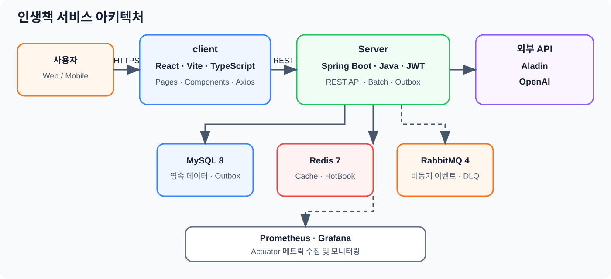

# 📚 인생책

알라딘 Open API와 OpenAI API를 활용해 도서를 탐색하고 추천하는 백엔드 서비스입니다.
회원의 관심 도서와 열람 이력을 바탕으로 개인화된 추천을 제공하며, 대규모 트래픽 환경을 고려해 설계했습니다.

## 🌐 운영 환경

| 구분 | URL                                                     |
| --- |---------------------------------------------------------|
| 운영 서비스 | `https://app.chaptersofu.com`                           |
## 🎯 프로젝트 목표

- 기획부터 설계, 개발, 배포, 모니터링까지 서비스 개발의 전 과정을 직접 경험합니다.
- 대규모 트래픽 환경에서 발생하는 동시성, 응답 속도, 자원 효율, 데이터 정합성을 고려한 시스템을 설계하고 구현합니다.
- 캐시, 비동기 메시징, 배치 처리, 장애 복구 전략을 실제 서비스 흐름에 적용합니다.

## 🏗️ 시스템 Structure

  

## 🛠️ 기술 스택

| 분류 | 기술 |
| --- | --- |
| Language | Java 21 |
| Framework | Spring Boot 3.5, Spring Batch |
| Data | Spring Data JPA, MySQL 8, Redis 7 |
| Messaging | RabbitMQ 4.0 |
| Resilience | Resilience4j, Outbox Pattern, DLQ, ShedLock |
| Authentication | JWT |
| External API | Aladin Open API, OpenAI API |
| Monitoring | Spring Boot Actuator, Micrometer, Prometheus, Grafana |
| API Docs | SpringDoc OpenAPI (Swagger UI) |
| CI/CD | Docker, Docker Compose |
| Test | JUnit 5, k6 |

## ✨ 주요 기능

### 🔍 도서 탐색 및 개인화 추천

- 알라딘 Open API를 통한 도서 조회 및 검색
- OpenAI API를 활용한 도서 정보 가공과 추천
- Resilience4j의 Circuit Breaker, Retry, Rate Limiter를 통한 외부 API 장애 대응
- Redis 캐시를 활용한 조회 성능 개선

### 👤 회원 및 활동 관리

- 회원가입, 로그인, 회원 정보 조회·수정·탈퇴
- JWT 기반 인증 및 인가

### 🔥 실시간 인기 도서

- 좋아요 이벤트를 RabbitMQ로 비동기 처리
- Redis Sorted Set을 활용한 인기 도서 Top 10 집계
- 캐시 기반 빠른 랭킹 조회

### 📨 안정적인 이벤트 처리

- Outbox 패턴을 적용해 데이터 변경과 이벤트 발행 간 정합성 확보
- 실패한 Outbox 이벤트를 스케줄러로 재발행
- RabbitMQ 재시도 및 Dead Letter Queue(DLQ)를 통한 실패 메시지 격리

### 📊 배치 및 모니터링

- Spring Batch로 알라딘 도서 데이터를 수집하고 데이터베이스에 적재
- 배치 완료 후 Redis 캐시 갱신
- ShedLock을 통한 다중 인스턴스 환경의 중복 스케줄 실행 방지
- Spring Boot Actuator, Prometheus, Grafana 기반 애플리케이션 모니터링
