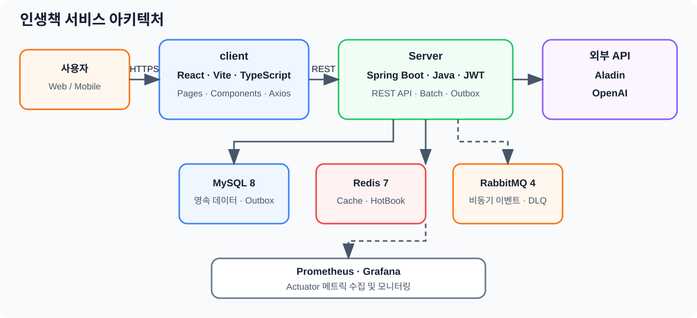

# 📚 인생책(책추천 서비스)

알라딘 Open API를 이용해 도서의 정보를 활용하고 OpenAI API를 이용해 도서의 내용을 압축 및 가공하여
사용자에게 도서를 추천하는 서비스 입니다.
대규모 쿠폰 발급 요청을 안정적으로 처리하기 위해 동시성, 응답속도, 데이터 정합성을 고려한 선착순 발급 시스템을 설계하고 구현했습니다.

## 목차

- [🌐 운영 환경](#운영-환경)
- [🏗️ 시스템 Structure](#시스템-structure)
- [🛠️ 기술 스택](#기술-스택)
- [✨ 주요 기능](#주요-기능)
- [🧑‍💻 주요 기술적 고민](#주요-기술적-고민)
- [🗂️ 프로젝트 구조](#프로젝트-구조)

<a id="운영-환경"></a>

## 🌐 운영 환경

| 구분        | URL                            |
|-----------|--------------------------------|
| 운영 서비스    | `https://app.chaptersofu.com`  |

<a id="시스템-structure"></a>

## 🏗️ 시스템 Structure

<p align="center">
  
</p>


<a id="기술-스택"></a>

## 🛠️ 기술 스택

| 분류 | 기술 |
| --- | --- |
| Language | Java 21 |
| Framework | Spring Boot 3.5, Spring Batch |
| Data | Spring Data JPA, MySQL 8, Redis 7 |
| Messaging | RabbitMQ 4.0 |
| Resilience | Resilience4j, Outbox Pattern, DLQ, ShedLock |
| Authentication | JWT |
| External API | Aladin Open API, OpenAI API |
| Monitoring | Spring Boot Actuator, Micrometer, Prometheus, Grafana |
| API Docs | SpringDoc OpenAPI (Swagger UI) |
| CI/CD | Docker, Docker Compose |
| Test | JUnit 5, k6 |

<a id="주요-기능"></a>

## ✨ 주요 기능

### 🔍 도서 탐색 및 개인화 추천

- 알라딘 Open API를 통한 도서 조회 및 검색
- OpenAI API를 활용한 도서 정보 가공과 추천
- Resilience4j의 Circuit Breaker, Retry, Rate Limiter를 통한 외부 API 장애 대응
- Redis 캐시를 활용한 조회 성능 개선

### 👤 회원 및 활동 관리

- 회원가입, 로그인, 회원 정보 조회·수정·탈퇴
- JWT 기반 인증 및 인가

### 🔥 실시간 인기 도서

- 좋아요 이벤트를 RabbitMQ로 비동기 처리
- Redis Sorted Set을 활용한 인기 도서 Top 10 집계
- 캐시 기반 빠른 랭킹 조회

### 📨 안정적인 이벤트 처리

- Outbox 패턴을 적용해 데이터 변경과 이벤트 발행 간 정합성 확보
- 실패한 Outbox 이벤트를 스케줄러로 재발행
- RabbitMQ 재시도 및 Dead Letter Queue(DLQ)를 통한 실패 메시지 격리

### 📊 배치 및 모니터링

- Spring Batch로 알라딘 도서 데이터를 수집하고 데이터베이스에 적재
- 배치 완료 후 Redis 캐시 갱신
- ShedLock을 통한 다중 인스턴스 환경의 중복 스케줄 실행 방지
- Spring Boot Actuator, Prometheus, Grafana 기반 애플리케이션 모니터링

<a id="주요-기술적-고민"></a>

## 🧑‍💻주요 기술적 고민

### 대규모 트래픽 쿠폰 발급 처리    
- 동시성: Redis Lua Script에서 중복 발급 확인, 재고 확인, 발급 회원 등록, 발급 수량 증가를 하나의 원자적 연산으로 처리했습니다. 
이를 통해 여러 서버에서 동시에 요청이 들어와도 재고를 초과해 발급되거나 한 회원에게 중복 발급되는 문제를 방지했습니다.
- 응답속도 : 발급 가능 여부는 Redis에서 빠르게 판단하고, 실제 발급 내역의 DB 저장은 RabbitMQ를 이용해 비동기로 분리했습니다. 
요청 처리 과정에서 DB 락과 동기식 INSERT로 발생할 수 있는 병목을 줄이고, 사용자에게 Redis 발급 승인 결과를 즉시 반환하도록 구성했습니다.
- 데이터 정합성 : 
  1. 메시지 발행 유실 방지 : 쿠폰 발급 승인과 이벤트 저장 사이의 정합성을 보장하기 위해 Outbox 이벤트를 비즈니스 트랜잭션과 함께 저장하였습니다. 
  트랜잭션 실패 시 Redis에 반영된 발급 예약을 롤백하여 Redis와 DB 사이의 불일치를 방지했습니다. 
  2. Consumer 처리 실패 대응 : Consumer에서 일시적인 장애가 발생하면 메시지를 최대 3회 재시도합니다. 
  재시도 후에도 처리되지 않은 메시지는 DLQ로 이동시켜 유실을 방지하고, 원인 확인 후 수동으로 재처리할 수 있도록 구성했습니다.
  3. 쿠폰 중복 지급 방지 : RabbitMQ의 at-least-once 전달 특성상 동일한 이벤트가 Consumer에서 여러 번 처리될 수 있습니다. 
  이에 member_coupon 테이블의 coupon_id, member_id 컬럼에 유니크 제약을 적용하여, 메시지가 재전송되더라도 동일 회원에게 같은 쿠폰이 중복 저장되지 않도록 했습니다.

<a id="프로젝트-구조"></a>

## 🗂️ 프로젝트 구조

```text
src/main/java/com/bkrc/bkrcv3
├── adapter/          # OpenAI 연동, 메시지 이벤트 핸들러
├── aladin/           # 도서 수집·조회·검색과 개인화 추천
├── batch/            # 알라딘 데이터 배치 수집, 필터링, 캐시 갱신
├── common/           # 공통 이벤트, 상수, ID 생성기, 유틸리티
├── config/           # Security, RabbitMQ, Batch, Swagger, 모니터링 설정
├── email/            # 회원 이벤트 소비자와 알림 처리
├── exception/        # 비즈니스 예외와 외부 API 예외
├── history/          # 사용자 도서 열람 이력 관리
├── hotbook/          # Redis Sorted Set 기반 인기 도서 집계
├── like/             # 도서 좋아요, 취소, 좋아요 수 정합성 처리
├── member/           # 회원 가입·조회·수정·탈퇴와 JWT 인증
├── outbox/           # Outbox 저장, 이벤트 발행, 실패 복구
├── recommendation/   # 사용자 추천평 등록·조회·수정
└── required/         # AI·이벤트 처리에 필요한 포트 인터페이스
```
